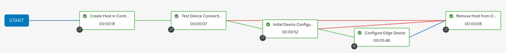
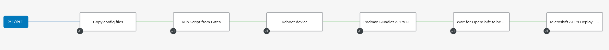

# Section 2 - Automated device onboarding
## Video

[](https://www.youtube.com/watch?v=R64e_BaVtF0)


---


During this section you need to bear in mind one important thing, during the device onboarding you will need to see the edge device Console terminal to see the device booting. This terminal is not the SSH terminal but the actual video output of the system. If you are using VMs for your demo/workshop that's not an issue because you can just open the VM's console but if you are using physical servers you will need either an external (big) screen connected to your device or a Video Capture Card (as the one shown in the [Recommended Hardware Section](README.md#recommended-hardware) to show the Console output on your laptop.

In this demo we will be distributing the RHDE image using an ISO. An Ansible Template is provided to generate the required ISO by using a standard RHEL ISO, and inject the generated/published kickstart into it, so when you start a VM/device with that ISO, it will deploy the created OSTree image and will run the designated automations in the kickstart as part of the onboarding. To generate the ISO you just need to:

* Go to `Templates` in Ansible Automation Platform and run the `Create ISO kickstart` Job. Default vars are ok, since the playbook will be using the contents from the production environment.

* When the Job is finished, you will see at the end of the output a `debug` message with the URL from where you can download the generated ISO.

  >**Note**
  >
  > Probably you will need to click on "Reload output" to see the full Job log if you didn't reload the page.

* If you are using a physical device: Write that ISO into a bootable USB key (ie. using a Software such as "Fedora Media Writer").

Now it's time to prepare your edge device:

* If you are using a physical device: You will need to configure your BIOS to first boot from USB using the interface that is connected to the local edge management server.

* If you plan to use a VM: You will need to create a VM with at least 2vCPUs, (at least) 3GB Memory, 50GB disk (it could be less but some services such as `wordpress` won't start) and 1 NIC connected to Internet. If you use `Virtual Machine Manager` (so `libvirt`) you should upload/locate the ISO file in any of the configured Libvirt Storage Pools so it can be selected to be used as boot method during the VM creation.

* You need to include your pull secret in a file on your Gitea repository. Create the `openshift-pull-secret` file in the path shown below and copy the content of you pull-secret:

```bash
cd <your rhde cloned repo>
mkdir prod/rhde_config/os/etc/crio/
vi prod/rhde_config/os/etc/crio/openshift-pull-secret
```

After including your pull-secret in that file, push your changes to Gitea

```bash
git add prod/rhde_config/os/etc/crio/openshift-pull-secret
git commit -m "Add pull-secret"
git push
```

  >**Note**
  >
  > This is important, if you don't do that your Microshift won't come up

Once everything is ready, go ahead with the device onboarding:


1. Open the "Jobs" page in the AAP and keep it visible while performing the following steps.


2. It's time to boot our edge device VM or physical server and perform the onboarding (if you didn't already) using the generated ISO as first boot option. 


3. Wait until the server boots. Few seconds later you will see that two Workflow Jobs are automatically launched in AAP:


* Provision Edge Device: It's a workflow that starts these three Jobs secuentially:




    - "Create Host in Controller Inventory": AAP needs a host created in the inventory to be able to manage it. This job creates two new entries. The first one as part of the "Edge Devices" hosts and the second one as a standalone entry. You can show the configurations made by opening the "Inventories" page in AAP and check the "Hosts" tab in both the `Edge Devices` and the `edge-<system mac address with no : characters>` inventories.

  >**Note**
  >
  > Take note of the edge device IP shown in "Hosts" inside the inventory since you will need it to SSH to it later.

    - "Test Device Connectivity": This is a quick check that the AAP can SSH to the recently added system into the inventory. Remember that if you include the `libreswan` package as part of the image, a VPN connection will be setup between the Edge Device and the Edge Manager server, this connection will be used to reach out to the device from the server, so with this playbookw you are also testing the VPN link in that case. 

  >**Note**
  >
  > In order to connect a machine in the local network to the remote node you will need to use a local subnet contained in `192.168.0.0/16` or `172.16.0.0/12`

    - Initial Device Configuration: Here is where the "real" onboarding automation is made. In our example we are only doing one thing with our systems: changing the host name from `localhost` to `edge-<system mac address with no : characters>`


   - Configure Edge Device: This is an additional workflow that:




      - Copy `/etc` config files into the device (from Gitea)
      - Run the onboarding Shell Script (from Gitea)
      - Reboot the device and wait until it comes up again
      - Deploy Podman Quadlet Applications (from Gitea)
      - Wait until Microshift is up and ready (from Gitea)
      - Deploy Microshift APP using Manifests (from Gitea)


  >**Note**
  >
  > It's a good time here to open the conversation about automating using Kickstarts/FDO VS doing it with EDA+AAP. Any of the automations configured in the kickstart file (less the AAP auto-registration) are suitable to be done by the AAP instead by the Kickstart. Probably for production is better to have it centralized in AAP. 
  

* Configure Edge Device: It's a workflow with a single Job:

    - Copy config files: Gets the files from `device-edge-configs/OS` in Gitea and copy them into the edge device.


4. The magic behind this automated workflow is that, as explained in [Section 1 - Creating RHEL Images the GitOps way](#section-1---creating-rhel-images-the-gitops-way), the kickstart file crestes an auto-registration Systemd unit and script that is launched on the system first boot. That scripts calls the Event Driven Automation service to start the workflows in AAP. You can now SSH to the edge device and check those script and systemd unit with the following commands as root: 


  >**Note**
  >
  > Please note that for this demo we are not authenticating the EDA requests for simplicity.
  
