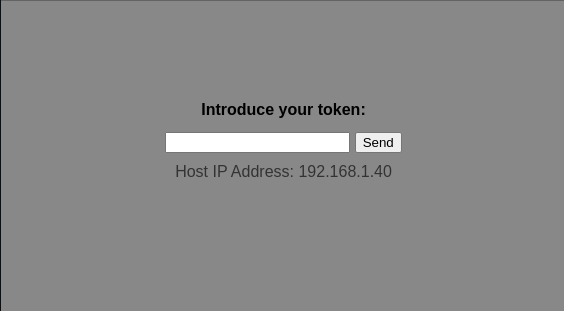

# Section 7 - Custom offline onboarding

## Video

[](https://www.youtube.com/watch?v=SaDnGbVHrZA)

---

  >**IMPORTANT Note**
  >
  > The time that it takes to create the RHDE image for this section is probably too long for a live demo. If you want to show what is below it's better to create the image and ISO in advance to save time. Copying the content to the USB keys before running the demo will also save some additional time.


## Onboarding workflows in this section

This section will show two possible onboarding workflows: Using a USB key or manual input using keyboard/screen


### USB-based auto-configuration


In this workflow you boot a the new edge device from the generated ISO, this will result in a fully unattended RHEL OSTree deployment (with MicroShift). The image contains all required elements so the deployment is prepared to be performed in a fully disconnected environment. 

Then, in order to include the secrets (remember that we are trying to avoid introducing those secrests in the ISO image) and any further required automation we connect a USB key with an encrypted file containing the digitally signed automations that we want to perform in the system. 

  >**Note**
  >
  > If the automations are not encrypted and/or signed with the right key those won't be taken into account. 

Right after plug the USB key it will trigger an unattendant process that will get the contents from the USB key, decrypt the file, check that the contents were generated by the approved manufacturer, and then execute the automations. 

  >**Note**
  >
  > In this case, the image will contain the decrypt key and the public cert to check the digitally signed contents while the scripts are provided externally using the USB key (those contents are encrypted to prevent people from accessing the secrets on the USB key).

This use case if perfect for situations where you don't have technical experts on site but you still need to perform some post-deployment actions on your devices. 

### Manual-input-based auto-configuration


In this case, as in the previous workflow, you boot a the new edge device from the (same) generated ISO, installing RHEL OSTree with MicroShift.

Then, instead using a USB key, you will manually introduce a token (which is in fact the decrypt key) in the console. That will trigger the decryption of an encrypted file with the required automations and will execute them.

  >**Note**
  >
  > In this scenario, the encrypted file is inside the image, and the decryption key is provided externally (unlike the previous scenario, where it was the other way around). It's important to note that, for simplicity (removing the need to create two different images), the example image definition provided during this scenario contains both workflows, with means that it will deploy both workflows simultaneously. Consequently, both the encrypted file (introduced to demo the manual-entry automation) and the decryption key (in the image to show the usb-automation) will end up both inside the image at the same time, compromising security. In a real-world environment, it's advisable to choose a single method so that the encrypted file and decryption key are kept separate, with one stored in the image and the other provided via USB KEY or manual entry.

You might find this approach useful for example in cases where you have devices with a keyboard and screen and you want to customize, for example, a static IP while deploying the device (you can create an app that makes easy for anyone to introduce network information and then that triggers the configuration using that info), or as already commented, if you want to provide the secrets separately from the image or if you want to include an application in your image but you don't want to make it work until someone don't introduce a valid token (license?).


## Steps

### Prepare the automation scripts

The provided example includes three automations:

- Injects the secrets needed by the `secret-http` APP to work
- Changes the device hostname
- Disables the kiosk-mode once the onboarding has finished (since in this use case it's only used to demonstrate the custom onboarding)

You can see the scripts in Gitea (`rhde/dev/rhde_config/scripts/offline-automation/input`)

You can include your own customization scripts here, so be creative if you want.

  >**Note**
  >
  >  If you add manifests, include one single object per file, do not split different objects using `---` in the same file.


These scripts contained in `rhde/dev/rhde_config/scripts/offline-automation/input` will be signed and encrypted by a Job (`Create Offline Automation Files`) launched in Ansible Automation Platform, and then pushed into `rhde/dev/rhde_config/scripts/offline-automation/output` in a file named `rhde_encrypted.tar`. In order to digitally sign and encrypt the file it is needed to provide an encryption token/key plus public/private certificates that will be introduced in the AAP Job as variables.

The Job already has predefined values that you can use, but if you want to create your own keys and certificates you can create them using another AAP Job: `Generate Encryption Pass and Keys` as an optional step.

So, having that in mind, the steps after preparing your onboarding scripts are the following

0. (optional) Generate the Encryption Pass and Keys by launching the `Generate Encryption Pass and Keys` Job in AAP. In the output of this Job will will find three tasks at the end:  `Output Encryption pass VAR value` , `Output Encryption public key VAR value` and `Output Encryption public key VAR value`. They will show the "one-line" output that you will need to use as variable values in the Job that you will run in the next step.


1. Create the Encrypted TAR file with the automations by running the `Create Offline Automation Files` Job in AAP. If you decided to run the previous step, creating your own keys and certificates you should change the value of the provided variables before running the Job, if not, the default will be ok. At the end you will have the `rhde/dev/rhde_config/scripts/offline-automation/output/rhde_encrypted.tar` file in Gitea.

  >**Note**
  >
  >  You can try to download the encrypted file, then the following command and enter right after the encryption pass/key: `openssl enc -d -aes-256-cbc -in rhde_encrypted.tar -out rhde.tar -pass stdin -pbkdf2`. If it works, you will find a new `rhde.tar` that you can extract since it's not encrypted anymore.


### Create the custom RPMs

As mentioned before, there are two different onboarding workflows that can be shown in this section: USB key based onboarding and Manual Token entry onboarding. Each of them will require to include several files in the image, and the way that we include custom files in the RHDE images is through custom RPM.

Two different custom RPMs must then be created. In this example it will be users who will be creating their own custom RPMs (in contrast with what we did in previous sections, where the custom RPMs were already pre-generated during the demo deployment), so each user will have their own two RPM packages: `<username>-usb-automation` for the USB key automation and `<username>-onboarding-kiosk` for the manual token entry onboarding.  

The RPMs are created using a Job in Ansible Automation Platform: `Create Custom RPMs` but before you need to include the files that you generated in the previous step (`rhde_encrypted.tar` or the encryption pass and public cert). The `Create Custom RPMs` Job will take the RPM definitions found in each directory in Gitea under `rhde/dev/rhde_image/custom-rpms`. If you take a look to the example provided you will see three custom RPMs: The `onboarding-kiosk` to provide the manual token entry onboarding, the `usb-automation` which will prepare the device to use the automatic USB key onboarding method, and the `microshift-manifests` that will include the manifest to auto-deploy the required applications in Microshift.

These are the steps:

2. Go to where you have your local clone of the `rhde` repository, copy the generated files (`rhde_encrypted.tar` -> `onboarding-kiosk`) (`rhde_automation_encryption_key` and `rhde-automation-pub.pem` -> `usb-automation`) and push the changes:

* Copy the `rhde/dev/rhde_config/scripts/offline-automation/output/rhde_encrypted.tar` into `rhde/dev/rhde_image/custom-rpms/onboarding-kiosk/rhde_encrypted.tar`

```bash
cd rhde

cp dev/rhde_config/scripts/offline-automation/output/rhde_encrypted.tar dev/rhde_image/custom-rpms/onboarding-kiosk/rhde_encrypted.tar
```

* Copy the `rhde_automation_encryption_key` and `rhde-automation-pub.pem` files into `rhde/dev/rhde_image/custom-rpms/usb-automation` directory 

```bash
cp dev/rhde_config/scripts/offline-automation/output/rhde_automation_encryption_key dev/rhde_image/custom-rpms/usb-automation/rhde_automation_encryption_key

cp dev/rhde_config/scripts/offline-automation/output/rhde-automation-pub.pem dev/rhde_image/custom-rpms/usb-automation/rhde-automation-pub.pem
```

* Push the changes

```bash
git add .
git commit -m "Generated offline files"
git push
```


3. Create the RPMs launching the `Create Custom RPMs` Job in AAP.

Once this task is done, if you want to double check that the RPMs are being generated and aggregated to the local repo, you can go to Cockpit (`https://<edge manager ip>:9090`), create a new test blueprint and try to look for any RPM package (ie. `git`). If that package appears in the list, it means that the Image Builder RPM repos are working and that you are good to move to the next point.

  >**Note**
  >
  >  This double check is important, because if you modified something incorrectly, or if something went wrong, the result will be that the Image Builder service won't be able to list any RPM package (not just the ones that you are trying to create) what means that you will be blocking all new Image Creation tasks even for other users. That's why maybe it is not a good idea to give the users the power to modify the Image Buider repo directly but remember, all of this is for demo proposes... 


### Create the Offline Image

Now it's time to create the image and associated ISO.

During the previous sections we have created different assets with the Image Builder. First we created the OSTree image and published it into the HTTP server, and during the FDO section we created directly an ISO with the Image Builder (Simplified Installer).

In this occasion, to embed the Container images, we are going to create an ISO with the Image Builder, but it will be the type `installer`, and not `simplified installer`. This type of ISO required manual steps that we will overcome by injecting a custom Kickstart after the ISO creation, obtaining a fully hands-off install ISO.

  >**Note**
  >
  >  The Image Builder takes more time to create an image type `installer` since in reality are two different image generations (same that it happened with the simplified installer), and on top of that time you need to add that we are injecting Container Images that we need to download and include into the image. We are talking something about 55 minutes in comparison with 10 minutes that it took in the previous sections. You save some time the second time that you run the build, so I suggest that you test how long it takes to create the image on the first and second run... and if you still find that the time is too much you will need to prepare the image in advance prior to start your demo, otherwise you could have people looking at the Image Builder for 55 minutes... 


The steps are the following:

4. Go to Gitea and open the `dev` image definition in `rhde/dev/rhde_image/dev-image-definition.yml`. Check that you have your three custom RPMs (in this example, you can create more). If you want you can create two different images, one for the USB key use case with only the `<user>-usb-automation` and `<user>-microshift-manifests` packages, and a different image for the manual token entry with `<user>-onboarding-kiosk` and `<user>-microshift-manifests`, that would be more realistic because you don't mix the encrypted file with its encryption key in the same image...but taking into consideration how long does it takes to generate one single image... maybe one image with both is still the best option. 

5. You will see that in this case, in the image definition we include the container images that we want to embed into the RHDE image (remember that it will be disconnected, so it cannot just download them from a public registry). You can see that there are two application images and then a list of "weird" container images. Those images are the one needed to run Microshift, but those are old, you need the lastest ones. In order to obtain the latest Microshift container images, you need to run in the AAP the Job `Get list of Microshift offline images`, then go to "output" and click on the "Get Microshift container images" task and you will have a list that you need to copy paste in your blueprint definition file in Gitea.

  >**Note**
  >
  >  Do not forget to include the application container images when you paste the list of Microshift images

  >**Note**
  >
  > The step where you get the latest images with the `Get list of Microshift offline images` Job is missing in the section video. I was using the latest images but I forgot to show how to run the Job and copy paste the right images in the image definition...sorry :-( 

6. It's time to create the image, if you want to show that the GitOps approach with the webhook is working, just change something in the definion (add the `tcpdump` package for example). Same that it happened in previous section, that change will trigger a Workflow in AAP that will generate the image.

  >**Note**
  >
  >  Remember, this time you have to wait more than in other sections


### Download the ISO 

In this section we are creating the image using the `edge-installer` Image Builder image type, which creates the OSTree repository along with an ISO image. This ISO can be customized by introducing a kickstart file. You  have two options, you can include Kickstart configuration as part of the variables in the image definition, or if you want to keep it simple (and maybe more flexible) you can get that generated ISO and inject manually the changes that you want (for example, I also reduce the wait time during GRUB menu and make the ISO work with legacy BIOS too, not only with UEFI).

When the `Compose Image` Job finishes on the Workflow launched in the previous point, you will find in the playbook output the location from where you can download the Image Builder generated ISO. Do not do it, first customize it with your kickstart:

7. Inject the kickstart file that you have in your Gitea repo (`rhde/dev/rhde_image/dev-kickstart.ks`) in the Image Buider generated ISO. To make it simple you have an already the Job `Create ISO Kickstart` in AAP. This time you cannot use the defaults as you did in previous sections, you will need to modify the launch variables to point to the right ISO. Use the example provided below as a template, you just need to change the username and the edge management server IP. After the Job is done, you will get in the output a message with the URL from where you can download the ISO file (~4.5GB).


```json
{
  "iso_base": "/var/www/html/<username>/dev/isos/<username>-dev-rhel-installer.iso",
  "kickstart_http_location": "http://<edge management server ip>/<username>/dev/dev-kickstart.ks",
  "iso_dst_path": "/var/www/html/<username>",
  "basearch": "x86_64",
  "offline": true,
  "image_environment": "dev"
}
```

8. When the Job finishes, you will see the URL from where you can download the ISO. It should be something like `http://<edge manager ip>/<username>/dev/iso/<username>-dev-rhel.iso`

### Deploy and trigger the onboarding

Once you have the ISO you just need to boot a machine using it to get your device onboarded. Remember that we have two different user cases to show, so you will need to servers/VMs.

In both cases we want to demonstrate that the onboarding can be done without external connectivity so it would be a good idea to connecter your server (either physical or virtual) to an isolated network.

9. Prepare or create two VMs (2vCPUs, 2GB memory and 50GB disk) in your isolated network. Boot from the downloaded ISO.

  >**Note**
  >
  > Create at least one device with 50GB disk instead of 20GB if you want to run the BONUS section with the automated offline image upgrade

No matter if you are running the use case with the USB key or the manual token entry, once RHDE is deployed in the device you should start in the same way:

10. Get the devices IPs and try to access `http://web-secret-http.apps.<ip>.nip.io` (it should fail because the APP does not have the required secrets). You can also SSH to the device and check the status of the APP in Microshift:

```bash
[root@localhost ~]# oc --kubeconfig /var/lib/microshift/resources/kubeadmin/kubeconfig get pod --all-namespaces
NAMESPACE                  NAME                                       READY   STATUS                       RESTARTS   AGE
kube-system                csi-snapshot-controller-799d579bd7-7kzzv   1/1     Running                      1          9m7s
kube-system                csi-snapshot-webhook-696b648c56-grg7r      1/1     Running                      1          9m3s
openshift-dns              dns-default-dvdvd                          2/2     Running                      2          8m49s
openshift-dns              node-resolver-rbp4g                        1/1     Running                      1          9m6s
openshift-ingress          router-default-55cb596bdc-cf46f            1/1     Running                      2          9m3s
openshift-ovn-kubernetes   ovnkube-master-q4ph2                       4/4     Running                      4          9m6s
openshift-ovn-kubernetes   ovnkube-node-pzmhl                         1/1     Running                      1          9m6s
openshift-service-ca       service-ca-5b58db65bf-mzr7r                1/1     Running                      1          9m3s
openshift-storage          topolvm-controller-6b777fd44d-jz2k6        5/5     Running                      5          9m7s
openshift-storage          topolvm-node-lgz76                         4/4     Running                      7          8m49s
secret-http                secret-http-6849ff6769-jxxp4               0/1     CreateContainerConfigError   0          9m2s
```

Now is when you can show the different use cases.


#### USE CASE 1 - Manual token entry using keyboard


11. Access the edge device console (If you are using a physical edge device you will need to connect a screen and keyboard), you should see something like this:

  >**Note**
  >
  > It could take a couple of minutes to show the page after booting the edge device



   >**Note**
  >
  > Before continue, it would be better that Microshift is Up because you will see the change in the APP inmediatelly after including the token, so use this trick: try to open the `http://web-secret-http.apps.<device ip>.nip.io/`, if you get "This site can’t be reached" then Microshift is not yet active, if you get "Application is not available" then it's (more or less) ready. 

12. Introduce the the encryption key (for simplicity, you can find it in Gitea in `rhde/dev/rhde_config/scripts/offline-automation/output/rhde_automation_encryption_key`. Wait some seconds after you see the message "Your service is now active". The key was generated with a short number of characters, which is less secure but more convenient to type on the console for the demo.

  >**Note**
  >
  >  If the encryption key is correct, it will use the scripts contained in the encrypted file to configure the service with the secrets. After the service configuration, the graphical session will be disabled in 5 seconds.

13. When the Kiosk mode disappears, refresh `http://web-secret-http.apps.<ip>.nip.io`, you should see now the secrets.


  >**Note**
  >
  > If something does not work, take a look at the Journal with `journalctl -f` while you introduce a new token in the console


#### USE CASE 2 - USB Key automation

14. Now you will use the other device that you have prepared, but before you need to copy the onboarding customization scripts (the `rhde_encrypted.tar` encrypted file that you can find in Gitea in `rhde/dev/rhde_config/scripts/offline-automation/output/rhde_encrypted.tar`). Copy the file in the USB root path.

  >**Note**
  >
  >  The USB needs regular FAT formating with a single partition (or at least the contents must be in the first partition of the USB key)

15. Now connect the USB with the `rhde_encrypted.tar` file on the root path that you have prepared in the device. After some time you can refresh the `http://web-secret-http.apps.<ip>.nip.io` page, and you should see then the secrets. Since the customization cannot be done until MicroShift services are deployed, if you try to use the USB customization right after the first boot of the VM, it can take longer (a couple of minutes). You might now that Microshift is Up with the same trick: try to open the `http://web-secret-http.apps.<device ip>.nip.io/`, if you get "This site can’t be reached" then Microshift is not yet active, if you get "Application is not available" then it's (more or less) ready. 

  >**Note**
  >
  > If you plugin the USB key right after the VM deployment nothing will happen for a while, the systemd service that review if USB keys are connected might not be up and also even if it's up Microshift could be not up yet... so it's better to let some time to have all services up and ready before connect the USB.

  >**Note**
  >
  >  If you are using Virtual Machine Manager with `libvirt` you can attach a USB by opening the VM, clicking on the "Virtual Machine" menu on the top and then "Redirect USB". If you are not sure which one is the USB stick you can physically disconnect and re-connect it to your laptop. If you cannot select the option (it's grey) you have to be sure that your user is part of the `libvirt` group.

16. After plugin the USB key, you will know when the automation is done if you check the edge device console, since the screen asking for "a token" will dissappear when the automation is done (the kiosk-mode that was included for the other use case is also disabled when the secrets are introduced). If you find any issue with this part, you can tail the `/var/log/usb_check.log` file, where the outputs of the USB automation are dumped. When the Kiosk mode disappears, refresh `http://web-secret-http.apps.<ip>.nip.io`, you should see now the secrets.


### BONUS: Automating OSTree offline upgrades with the same approach

## Video

[](https://www.youtube.com/watch?v=b_a3_hENUNs)

---

  >**Note**
  >
  > The edge device needs to have enough space to host the new OSTree image, if not the upgrade will fail. 20 GB is not enough, use a 50GB disk.


You can use the same approach to minimize human interaction when upgrading your edge device to a newer version. The idea is to generate the new image in the Image Builder and include it along with the automation scripts on a USB key.

Then someone will connect the stick to the edge device and it will then automatically verify the digital signatures of the included automation scripts. Upon successful verification, the device will execute the automation scripts, utilizing the image stored on the USB key to carry out the upgrade seamlessly and without requiring human intervention.

It's important to mention that in the demo the upgrade automation is also included in an encrypted file, and only the right key (which is part of the image) will decrypt the content. This will ensure that someone does not create their own image and just plug a USB key with it and upgrade the device without your "permission".

You will need to take two additional actions before running the automated upgrade:

* Generate the new image (yes...more waiting, better to have it already created before the demo too).

* Generate the automated script that will upgrade the system and include it along with the new image in the USB key

  >**Note**
  >
  > You will also save some time if you have two USB keys instead of just one, and you pre-copy the contents on it before the demo starts.


#### Generate the new image

1. The first obvious part is to generate an updated image. You can go to Gitea and modify the image description in `rhde/dev/rhde_image/dev-image-definition.yml`, for example including the `bind-utils` package


While the image is being created, you can prepare the USB key.


#### Create the automation script and copy the contents to the USB key

Instead of using the Ansible playbooks in AAP as we did before, this time we will create the USB contents with a shell script, so you can take a look at it and easily get an idea how the encrypted content is generated.

2. You need to get the private and public certs and the Encryption password. Remember that if you want to use the same that you used in the previous steps you can get them from Gitea (remember that this is a demo, **please do not store secrets such as private certificates or encryption keys in Git in your real environment**), more specifically in `rhde/dev/rhde_config/scripts/offline-automation/output`

```bash
~/tmp/demo 
❯ tree
.
├── rhde_automation_encryption_key
├── rhde-automation-pri.pem
└── rhde-automation-pub.pem

1 directory, 3 files
```


3. Create an `input` and `output` directories

```bash
~/tmp/demo 
❯ tree
.
├── input
├── output
├── rhde_automation_encryption_key
├── rhde-automation-pri.pem
└── rhde-automation-pub.pem

1 directory, 3 files
```


4. Create the script that will generate the ecnrypted TAR file in the `output` directory with the contents that you put in the `input` directory:

```bash
#!/bin/bash
echo "Creating temporal directories"
rm -rf output
mkdir -p output/tmp/files/rhde
mkdir -p output/tmp//files/rhde-automation

echo "Copying input files"
cp -r input/* output/tmp/files/rhde-automation

echo "Creating TAR and signature"
tar -C output/tmp/files -zcf output/tmp/files/rhde-automation.tar.gz rhde-automation
openssl dgst -sha256 -sign rhde-automation-pri.pem -out output/tmp/files/rhde-automation-signature.sha256 output/tmp/files/rhde-automation.tar.gz


echo "Creating Encrypted TAR"
mv output/tmp/files/rhde-automation-signature.sha256 output/tmp/files/rhde
mv output/tmp/files/rhde-automation.tar.gz output/tmp/files/rhde
tar -C output/tmp/files/ -cf output/tmp/files/rhde.tar rhde/
openssl enc -aes-256-cbc -salt -in output/tmp/files/rhde.tar -out output/tmp/files/rhde_encrypted.tar -pass "file:rhde_automation_encryption_key" -pbkdf2
mv output/tmp/files/rhde_encrypted.tar output

echo "Cleaning"
rm -rf output/tmp
```

I named the script `create_encrypted_automation.sh`, so the directory tree now looks like this:


```bash
~/tmp/demo 
❯ tree
.
├── create_encrypted_automation.sh
├── input
├── output
├── rhde_automation_encryption_key
├── rhde-automation-pri.pem
└── rhde-automation-pub.pem

3 directories, 4 files
```

5. Now prepare the contents and copy them into a `input` directory. In this case you need to include two items in your automation bundle: the new OSTree image (in a TAR file) and the shell script that performs the upgrade steps.

The TAR file with the new image can be downloaded from the HTTP server. We are using the `dev` environment, so you will be able to download it from `http://<edge manager ip>/<username>/dev/rhde-image.tar`


Create an `upgrade.sh` shell script that performs the upgrade using the TAR file that you downloaded in the previous step, for example:

```bash
#!/bin/bash

script_dir="$(dirname "$0")"
repo_tar="${script_dir}/rhde-image.tar"
repo_dir="/var/install/repo/ostree"

if [ ! -d $repo_dir ]; then
    mkdir -p  $repo_dir
fi

echo "Change repo location (for demo)" 
sed -i "s|^url=.*|url=file://${repo_dir}/repo|" /etc/ostree/remotes.d/edge.conf

echo "Getting the new image"
tar xvf $repo_tar -C $repo_dir

echo "Upgrading..."

ostree pull-local $repo_dir/repo
rpm-ostree update --preview
rpm-ostree update
rpm-ostree status

echo "Rebooting..."
sleep 5
systemctl reboot
```


Copy those files into the `input` directory, you will end up with this directory tree:

```bash
~/tmp/demo 
❯ tree
.
├── create_encrypted_automation.sh
├── input
│   ├── rhde-image.tar
│   └── upgrade.sh
├── output
├── rhde_automation_encryption_key
├── rhde-automation-pri.pem
└── rhde-automation-pub.pem

3 directories, 6 files
```


6. Run the script


```bash
❯ ./create_encrypted_automation.sh 
Creating temporal directories
Copying input files
Creating TAR and signature
output/tmp/files/rhde-automation/
output/tmp/files/rhde-automation/rhde-image.tar
output/tmp/files/rhde-automation/upgrade.sh
Creating Encrypted TAR
Cleaning
```


You will get the encrypted TAR file in the `output` directory:


```bash
❯ tree
.
├── create_encrypted_automation.sh
├── input
│   ├── rhde-image.tar
│   └── upgrade.sh
├── output
│   └── rhde_encrypted.tar
├── rhde_automation_encryption_key
├── rhde-automation-pri.pem
└── rhde-automation-pub.pem

3 directories, 7 files
```


If you want to test that the file was encrypted correctly, you can try to decrypt using the encryption pass file using the following command:

```bash
openssl enc -d -aes-256-cbc -in output/rhde_encrypted.tar -out output/rhde.tar -pass "file:rhde_automation_encryption_key" -pbkdf2
```


7. Copy the `rhde_encrypted.tar` file to the USB key (top directory)

  >**Note**
  >
  > It takes time to copy the file since it contains the OSTree image

#### Run the upgrade

8. SSH into the device and see the running image with the `sudo rpm-ostree status` command. You can also open the log file to see what something happens with you plugin the USB key: `tail -f /var/log/usb_check.log`


9. Plug in the USB key and wait until the device reboots


  >**Note**
  >
  > It takes time to complete because it needs to decompress/copy the OSTree image


If you open the `/var/log/usb_check.log` will get an output like this one at the end, right before the restart, where you can see that the new image will be applied on the next boot:

```bash
...
AvailableUpdate:
        Version: 9.3 (2024-06-21T06:49:27Z)
         Commit: 7663a8f462d6bdca8859ba614c506e09eb5159e1f3924327716ed2e5cc67fdde
          Added: bind-libs-32:9.16.23-14.el9_3.4.x86_64
                 bind-license-32:9.16.23-14.el9_3.4.noarch
                 bind-utils-32:9.16.23-14.el9_3.4.x86_64
                 fstrm-0.6.1-3.el9.x86_64
                 libmaxminddb-1.5.2-3.el9.x86_64
                 libuv-1:1.42.0-1.el9.x86_64
0 metadata, 0 content objects imported; 0 bytes content written
Staging deployment...done
Added:
  bind-libs-32:9.16.23-14.el9_3.4.x86_64
  bind-license-32:9.16.23-14.el9_3.4.noarch
  bind-utils-32:9.16.23-14.el9_3.4.x86_64
  fstrm-0.6.1-3.el9.x86_64
  libmaxminddb-1.5.2-3.el9.x86_64
  libuv-1:1.42.0-1.el9.x86_64
Run "systemctl reboot" to start a reboot
State: idle
Deployments:
  edge:rhel/9/x86_64/edge
                  Version: 9.3 (2024-06-21T06:49:27Z)
                   Commit: 7663a8f462d6bdca8859ba614c506e09eb5159e1f3924327716ed2e5cc67fdde
                     Diff: 6 added

● edge:rhel/9/x86_64/edge
                  Version: 0.0.4 (2024-06-20T16:06:07Z)
                   Commit: 380aa1d5b474d798c80746a9fb10110867f5aa81f1a942b3752866d676faf85b
...
```


10. Check again the device images with `sudo rpm-ostree status`

```bash
[root@localhost ~]# rpm-ostree status
State: idle
Deployments:
● edge:rhel/9/x86_64/edge
                  Version: 9.3 (2024-06-21T06:49:27Z)
                   Commit: 7663a8f462d6bdca8859ba614c506e09eb5159e1f3924327716ed2e5cc67fdde

  edge:rhel/9/x86_64/edge
                  Version: 0.0.4 (2024-06-20T16:06:07Z)
                   Commit: 380aa1d5b474d798c80746a9fb10110867f5aa81f1a942b3752866d676faf85b
```


