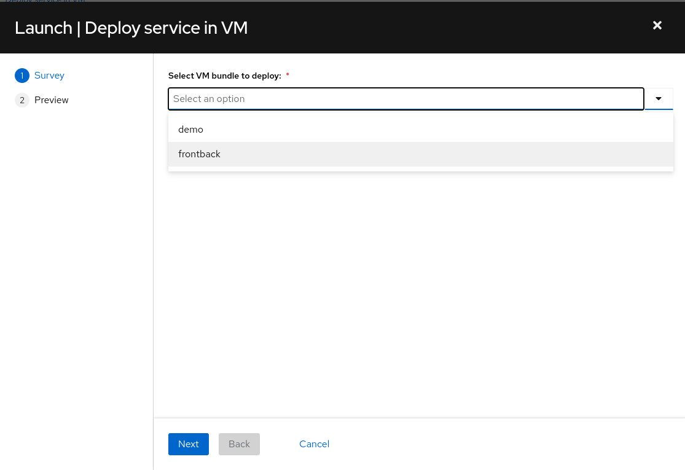
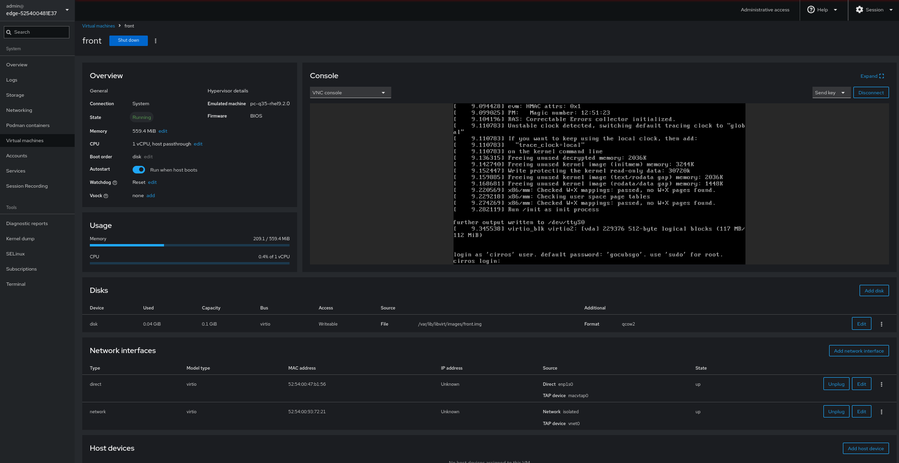

# Section 8 - Virtual Machine management

## Video

---

This section will focus just on the VM deployment, not the VM configuration. For the Virtual Machine configuration you can use multiple tools, including the Ansible Automation Platform, but that would be out of the scope of the RHDE + AAP GitOps demo.

  >**Note**
  >
  > During this section you will run VMs on your edge device, so you will need either a physical edge device or enable nested virtualization in the Host that is running your edge VMs before continuing with the rest of the steps.

The idea for this section is to use one of the devices deployed in the `prod` environment since, if you used the provided image description, those will have the requiered rpm packages to run VMs already installed.

Let's review the steps:

  1. Go to Gitea in `http://<edge manager ip>:3000` and show files under `rhde/prod/rhde_config/virt`. You will see some directories. Those directories contain a "VM bundle" which is the combination of the VMs and all the required KVM objects needed by those VMs such as networks or storage pools. 

  2. You will need to select the Hosts where the VMs will be deployed. You can create a new inventory or just point directly to the host that you want to use, but in section we are going to see an example of how you can "reuse" your base "Edge Devices" inventory by "tagging" the hosts where you want to deploy an specific "VM bundle", in this case by adding an specific variable associated to those hosts. Open the "Edge Devices" inventory and go to the "Hosts tab". Open one or multiple hosts where you want to deploy the VM Bundle. At the end of the associated variables you will find a variable `"kvm_type": "changeme"`. Click on "Edit" and change the value to the VM Bundle's name, let's say for example `frontback`.

  3. One point that is important to bear in mind in this section is that although we have the descriptors in Gitea, the demo does not have configured any webhook to trigger Jobs in AAP, so in this case we need to run it manually. Go to the AAP (`https://<edge manager ip>:8443`) and in `Templates` section look for the "Deploy service in VM" Workflow and click in the rocket icon to launch it. Select the VM bundle that you want to deploy and run the Workflow.    
    
  >**Note**
  >
  > One thing that you will notice in comparison with other previous sections, is that this time you don't get a page where you can manipulate the ansible variables before launching the Job, but you get a page with a dropdown menu with the available "VM bundles to be installed". This is a different way to customize the ansible variables which in AAP is call "Survey" (These Surveys can be configured in any Job or Workflow so potentially we could have been using them in other sections). Surveys are a great way to simplify JOB/Workflow launch when you are not using GitOps (with GitOps the webhook has already configured the "right" ansible variables used in the launch).

  4. When the Workflow is finished, go to the device Cockpit (`https://<edge device ip>:9090`), jump into the "Virtual Machines" menu and check that the VMs and associated resources were created. You can open one VM and see that it is running and you can see the console.

  5. Once you checked that the VMs were created and can run on the device, you could shutdown them by running the  "KVM - Stop all bundle VMs" Job in AAP
  

With the VMs deployed and running, now you should move into the VM configuration (which is out of the scope of this demo). Depending on the image that you used, you have multiple options to configure and manage day-2 of your VMS, for example, you can configure the network in your VM and add the VM into an inventory in AAP and start managing them from there, or if you are using Cloud images, you could also use cloud-init (but in that case during the deployment) to auto-configure your VMs.

Here we deployed the VMs from the definitions that we had in Gitea, but of course you can use a simple Job in AAP to create those VMs directly, even you could create a Survey (as the example that we have seen in this section) that ask you for CPU, Memory, disk and give you a list of approved base images while launching that Job to simplify this task. 
