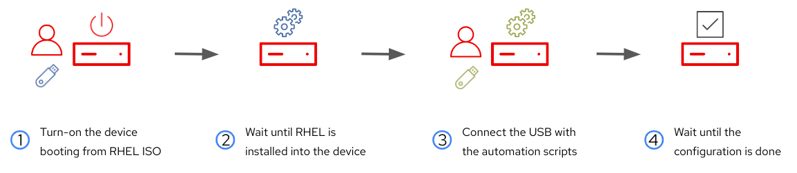
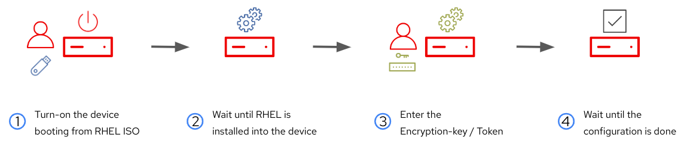

# MicroShift disconnected with onboarding customization

## Background 

Sometimes you have to deploy MicroShift in an environment where there is no external connectivity. In that case you will need to embed all the required components (container images, manifests, ...) in the RHEL image.

But you probably will need to include secrets as part of your onboarding. Adding secrets to an image (if those are not encrypted) is not a good idea since someone can steal the image (ie. get the ISO) and then extract your secrets from it.

Usually this problem can be solved by performing a "late binding" onboarding approach such as what you get with [FIDO FDO](https://fidoalliance.org/device-onboarding-overview/), but in a disconnected environment probably you won't have access to external servers (ie. FIDO FDO servers), so you will need to introduce those secrets after the deployment in another different way. 

Several companies/people are including customizations and secrets as a second step right after the device deployment using a USB stick or a manual entry using local keyboards and screens. 

USBs are commonly used because it could happen that your edge devices lack of screens and even keyboard inputs, so one possible way to introduce those customizations is making that the device detects that someone has connected a USB and then, automatically, gets the secrets, automations, etc from it and then applies them into the system.

This also introduce some risks, for example, someone could stole the USB and get access to the secrets, or someone could potentially change the automations and configure the system in the way that THEY want instead, not the way that YOU want. One easy way to remove those risks is to encrypt the contents of the USB, so if you don't have the key you cannot access the contents, and also digitally sign the automations and secrets, in order to be completely sure that those have not been modified by somebody else.

This repo makes possible to demo this scenario in an easy way.


## Overview of the onboarding workflow

Here you can find the onboarding workflows that we want to show for the microshfit disconnected edge device.

### USB-based auto-configuration



In this workflow you boot a the new edge device from the generated ISO, this will result in a fully unattendant RHEL OSTree deployment (with MicroShift). The image contains all required elements so the deployment is prepared to be performed in a fully disconnected environment. 

Then, in order to include the secrets (remember that we are trying to avoid introducing those secrests in the ISO image) and any further required automation we connect an USB with an encrypted file containing the digitally signed automations that we want to perform in the system. 

  >**Note**
  >
  > If the automations are not encrypted and/or signed with the right key those won't be taken into account. 

Right after plug the USB it will trigger an unattendant process that will get the contents from the USB, decrypt the file, check that the contents were generated by the approved manufacturer, and then execute the automations. 

  >**Note**
  >
  > In this case, the image will contain the decrypt key and the public cert to check the digitally signed contents while the scripts are provided externally using the USB (those contents are encrypted to prevent people to get access the secrets on the USB).

### Manual-input-based auto-configuration



In this case, as in the previous workflow, you boot a the new edge device from the (same) generated ISO, installing RHEL OSTree with MicroShift.

Then, instead using an USB, you will manually introduce a token (which is in fact the decrypt key) in the console. That will trigger the decryption of an encrypted file with the required automations and will execute them.

  >**Note**
  >
  > In this scenario, the encrypted file is within the image, and the decryption key is provided externally (unlike the previous scenario, where it was the other way around). It's important to note that these demonstration playbooks, for simplicity, deploy both workflows simultaneously using the same image. Consequently, both the encrypted file and the decryption key end up both inside and outside the image simultaneously, compromising security. In a real-world environment, it's advisable to choose a single method so that the encrypted file and decryption key are kept separate, with one stored in the image and the other provided via USB or manual entry.

## What is this repo doing?

The Ansible playbooks will:

Environment:
* Install and configure Image Builder
* Add the required MicroShift repos to image builder 
* Include the pull-secret in the image builder to be injected in the MicroShift image

MicroShift disconnected
* Gather the MicroShift container image tags to be used offline
* Generate a custom RPM that will embed the app manifests into the image
* Detect the container images that are used by the manifests
* Generate the blueprint with the embedded images (including MicroShift and the ones used in the manifests) and the custom RPMs from a provided blueprint
* Create the RHEL image and the ISO

USB-based customization
* Generate a custom RPM that will embed the scripts that automates the configuration throught the USB
* Generate the contents of the USB that will be used during the demo to automate the system

Manual-input-based customization:
* Generate a custom RPM that will embed the scripts that automates the kiosk mode activation and the token-based autoconfig application
* Inject the encrypted file with the auto-config shell scrips (the same one that then one used for the USB automation) in the image


##  References

- [Red Hat official documentation for MicroShift](https://access.redhat.com/documentation/en-us/red_hat_build_of_microshift/4.13)
- [Red Hat official documentation for RHEL OSTree](https://access.redhat.com/documentation/en-us/red_hat_enterprise_linux/9/html-single/composing_installing_and_managing_rhel_for_edge_images/index)
- [Red Hat Device Edge introduction](https://cloud.redhat.com/blog/introducing-the-new-red-hat-device-edge)
- (Red Hat internal) [Red Hat Device Edge slide deck](https://docs.google.com/presentation/d/1FKQDHrleCPuE0e36UekzXdkw86wNDx16dSgllXj-swY/edit?usp=sharing)
- [OSTree based Operating Systems article](https://luis-javier-arizmendi-alonso.medium.com/a-git-like-linux-operating-system-d84211e97933)
- [FDO article - first part](https://luis-javier-arizmendi-alonso.medium.com/edge-computing-device-onboarding-part-i-introducing-the-challenge-59add9a86200)
- [Image Builder quickstart bash scripts](https://github.com/luisarizmendi/rhel-edge-quickstart)
- [Ansible Collection for OSTree image management](https://github.com/redhat-cop/infra.osbuild)
- [How to create a fully self contained OS image that includes your Kubernetes workload](https://www.redhat.com/en/blog/how-to-create-a-fully-self-contained-os-image-that-includes-your-kubernetes-workload)


<hr style="border:2px solid gray">

## TL/DR 
<hr style="border:2px solid gray">

If you are short in time and you don't want to read the demo instructions, here it is a summary:

1. Be sure that you are using the latest `os-build` Ansible Collection from the `redhat-cop`.

> laptop
```bash
ansible-galaxy collection install -f git+https://github.com/redhat-cop/infra.osbuild --upgrade
```

2. Clone this repo and create a `vars/secrets.yml` Vault file and include your pull secret in the `microshift_pull_secret` variable.

> laptop
```bash
ansible-vault create vars/secrets.yml
```

3. Install the RHEL 9.x system that will be the Image Builder and include its IP in the `inventory` 

4. Run the playbook:

> laptop
```bash
ansible-playbook -vvi inventory --ask-vault-pass playbooks/main.yml
```

5. Download the ISO from the URL shown in the last `debug` message and also copy the contents that you find in `files/others/usb-contents` (so the file `rhde_encrypted.tar`) in the root path of an USB stick

6. Deploy the edge device using the ISO. Be sure that you are using `UEFI` boot and an isolated network.

7. Get the edge device IP and show `web-secret-http.apps.<ip>.nip.io`, there shouldn't be values for the secret variables yet.

NOW, you have two options:

**USB-based auto-configuration**

8. Connect the USB and wait some seconds

9. Refresh `web-secret-http.apps.<ip>.nip.io`, you should see now the secrets.

**Manual-input-based auto-configuration**

8. Use the graphical console to introduce the token (the encryption key that you can find in `files/others/rhde_automation_encryption_key`) and wait some seconds

9. Refresh `web-secret-http.apps.<ip>.nip.io`, you should see now the secrets.


<br><br>

<hr style="border:2px solid gray">

## Pre-requisites
<hr style="border:2px solid gray">

You can use either baremetal servers or VMs. You will need a RHEL 9.x (tested with RHEL 9.3) running Image Builder (at least 2 vCPUs, 4 GB memory, 200 GB disk, 1 NIC) and an edge device (2 cores, 3 GB memory, 30 GB disk, 1 NIC).

  >**Note**
  >
  > If you want to show both workflows, the one based on USB and the one based on manual entry, you will need two different edge devices.

  >**Note**
  >
  >  You could potentillay use less than 30 GB for the edge device if you don't plan to perform/test upgrades. By default, the partition will take 25 GB for the OS and let 5 GB for the MicroShift Persistent Volumes. If you want to change those values you can addapt the partition sizes on the `vars/main.yml` in the kickstart section.

You need an active Red Hat Enterprise Linux subscription.

If you plan to use the USB-based customization you will need a 1GB USB key, or a 8 GB key if you want to use physical hardware instead of VMs for your edge device or if you also want to upgrade your image with to newer image version using that USB key.

In order to access the APPs published in Microshift you will need to resolve a DNS wildcard in your DNS server (pointing to the edge device). In really small disconnected environments that could be challenging (imagine that you just have the router and a single server that will be your edge device with Microshift). In that case, one possible solution could be to deploy a DNS server on top of Microshift to resolve those names (even you can configure kubernetes external dns integration to dynamically configure new APP ingress routes in the DNS service). This has not been implemented in this repo (yet?), I took a more simple solution.

The Edge device will be in a disconnected environment (physical or virutal) but probably the laptop from where you are running the demo will be connected, so I decided to use the `nip.io` domain for the node. This domain is a wildcard that always resolve the IP address that has been included in the domain name before `nip.io` (ie. `1.2.3.4.nip.io` will resolve `1.2.3.4`).


If you use physical Hardware you will need:

+ Two servers with the minimum requirements mentioned above.
+ Access Point or Router that can provide DHCP (and maybe Internet access for your laptop). If it can provide DNS wildcards it could be also interesting to configure instead of using `nip.io` addresses.
+ Network Switch if you Access Point / Router does not have at least 3 free interfaces
+ At least 3 RJ45 cables
+ Depending on your laptop you will need aditional adapters (ie. to provide RJ45 interface). Also in certain venues where use HDMI over RJ45 sometimes you could find that your Linux machine does not mirror the screen correctly when using direct HDMI cable, but it works if you connect it to an HDMI port in a USB C adapter (???), so I finally got [this adapter that has both RJ45 and HDMI output](https://www.amazon.es/dp/B0CBVDRPZD?ref=ppx_yo2ov_dt_b_product_details&th=1).
 

Maybe it's also interesting to adquire these gadgets to not having to carry screens or big keyboards:

+ USB Keyboard (I use one of [this USB RFID mini keyboards](https://www.amazon.es/dp/B07RQBRRR7?psc=1&ref=ppx_yo2ov_dt_b_product_details), but be sure that it does not use just Bluetooth)
+ Video Cable (and HDMI - DisplayPort adapter if needed) and external Monitor to show boot console. If you don't want to use an external screen you can also use a [Video Capture card like this one](https://www.amazon.es/dp/B0CLNHT29F?ref=ppx_yo2ov_dt_b_product_details&th=1) that I use that can show the physical device video output as a video input (camera) in your laptop.


<hr style="border:2px solid gray">

## Demo preparation

<hr style="border:2px solid gray">


BEFORE delivering the demo, you have to complete these preparation steps.

### ~ ~ ~ ~ Preparing the Image Builder ~ ~ ~ ~

You need a subscribed [Red Hat Enterprise Linux 9](https://access.redhat.com/downloads/content/479/ver=/rhel---9/9.3/x86_64/product-software) system (minimal install is enough) with at least 2 vCPUs, 4 GB memory and 200 GB disk. If you plan to create multiple images probably you will need to add more disk space.

  >**Note**
  >
  > Image Builder won't show clear error messages when you try to build images and you don't have enough space, so if you run multiple builds and you find an error try to remove the old contents or add more space to the server.

If you want to remove old contents from previously created images you can run these commands in the Image Builder:

> Image Builder
```bash
rm -rf /var/www/html/microshift-embedded/
rm -rf /tmp/microshift-embedded/
for i in $(composer-cli compose status | awk '{print $1}'); do composer-cli compose delete $i; done
```

If you don't want to use `root`, be sure that the user has [passwordless sudo access](https://developers.redhat.com/blog/2018/08/15/how-to-enable-sudo-on-rhel).


### ~ ~ ~ ~ Preparing your laptop ~ ~ ~ ~

Your will need to:

1. Install Ansible (or ansible-core depending on your version)

> laptop
```bash
dnf install -y ansible
```
  >**Note**
  >
  > Or `ansible-core` in some systems.


2. Download the `infra.osbuild`  Ansible collection. Be sure that you have the latest version of the Collection from the `redhat-cop`, so it contains a PR that I created to enable custom TOML files: https://github.com/redhat-cop/infra.osbuild/pull/357

> laptop
```bash
ansible-galaxy collection install -f git+https://github.com/redhat-cop/infra.osbuild --upgrade

```

  >**Note**
  >
  >  There is a bug in ansible-galaxy 2.14 that does not search for hidden folders, be sure that you are using ansible-galaxy version 2.15.

3. Clone the repo: `git clone https://github.com/luisarizmendi/edge-demos`

4. Move to the `edge-demos/demos/microshift-disconnected` directory

5. Modify the Ansible `inventory` file with your values

6. Modify the Ansible `vars/main.yml` file with your values. Some interesting values are:

    * `microshift_release`: You can change the Microshift release but bear in mind of any possible changes between the tested release (4.14) and your selection.

    * `microshift_embedded_generate_blueprint`: if you want to manually create the blueprint file with the embedded images instead of let the playbooks to do it, you could switch this variable to `false` and create your own `files/blueprint-microshift-embedded.toml` file.

    * `usb_automation`: Change to `false` if you don't want to include the scripts to automate the onboarding using the USB.

    * `microshift_config`: Change the variables to fit your environment, for example, if you are using a proper DNS server and not `nip.io`.

    * `kiosk_automation`: The default is to enable both the manual-input-based automation and the USB-based automation. If you want to disable the manual-entry automation you can change this variable to `false`. 


7. Copy your public SSH key into the Image Builder system, so you can open passwordless SSH sessions with the user that you configured in your Ansible inventory. (double check .ssh and authorized_keys permissions in case you are still asked for password after copying the key).

> laptop
```bash
ssh-copy-id <user>@<image builder IP>
```

8. If you are using your laptop as hypervisor, be sure that you have at least 2 vCPU, 3GB memory and 30 GB disk free to create the Edge device VM (in addition the Image Builder VM that you should have already up and running).


### ~ ~ ~ ~ Prepare your pull secret ~ ~ ~ ~

Once you have your laptop ready, you can run the playbooks to create and include your image in an ISO that you can use to deploy your device but before you need one more thing.

As part of the image preparation, you will be injecting your **pull secret** as an Ansible variable so [get your pull secret from the Red Hat Console](https://cloud.redhat.com/openshift/install/pull-secret). Although you could just create a plain variable in vars/main.yaml it's highly recommended to encrypt sensitive information, so it's better to [Ansible Vault](https://docs.ansible.com/ansible/latest/vault_guide/index.html) by creating the encrypted variable file (protected by a password that you configure) using the following command:

> laptop
```
ansible-vault create vars/secrets.yml
```

Then add the variable `microshift_pull_secret` in that file with the right value and then save it.

```yaml
microshift_pull_secret: '<YOUR PULL SECRET>'

```

  >**Note**
  >
  >  *Remember to include `--ask-vault-pass` when you try to run your Ansible playbooks containing Ansible Vault encrypted files*


By default the manifests under `files/manifests` will be deployed along with microshift. If you want to skip that step just comment out the `microshift_test_app_template` line in vars/main.yaml. You can also include your own manifests there.


### ~ ~ ~ ~ (optional) Customize your onboarding scripts and APPs ~ ~ ~ ~

The repo includes three applications on your disconnected Microshift: `2024`, `test` and `secret-http`. The last one is the APP that will be used to show the secret injection from the USB (so it won't work showing the credential values until you connect the USB)

You can add your own manifest too, just create a new directory under `files/manifests` and include your manifest files there with `yaml` or `yml` extensions.

  >**Note**
  >
  >  Include one single object per file, do not split different objects using `---` in the same file.

You can also add or change the proposed automation scripts that you find under `files/others/rhde-automation`. Those will be digitally signed and encrypted by the playbooks so the edge device apply them once you connect the USB after the first deployment.


### ~ ~ ~ ~ Create the image and the ISO ~ ~ ~ ~

Ok, it's time to create the ISO. Run the following Ansible Playbook from `edge-demos/demos/microshift-disconnected` directory:

> laptop
```bash
ansible-playbook -vvi inventory --ask-vault-pass playbooks/main.yml
```

If you included new manifest in the previous step or modified the ones provided you won't need to include the new container image names anywhere since the playbooks will look for the images used in your manifests and will embed automatically those ones as part of the RHEL image.

Once the Ansible Playbook is finished, you will see the URL where the ISO is published in the last Ansible `debug` message. Download it. 

### ~ ~ ~ ~ Prepare the USB drive ~ ~ ~ ~

If you didn't disable it in the `vars` file, the previous playbook created under the `files/others/usb-contents` directory the contents that you have to include in the root directory of you USB (fat32) . 

By default it creates an encrypted tar (`rhde_encrypted.tar`) file that contains the digitally signed scripts that you find in the `files/others/rhde-automation` directory (that you had the chance to customize in a previous step). Copy the file in the USB. 


### ~ ~ ~ ~ Prepare the edge device ~ ~ ~ ~

Follow these steps:

0. If you plan to use virtual machines you will need to create a new VM that will be the Edge Device with at least 2 vCPU, 3GB memory, 30 GB disk and one NIC.

1. **Network**: The edge device should be connected to a network that has no external access in order to test the disconnected deployment. If you are using VMs with `libvirt` you can create an `isolated` network (keep DHCP enabled). That network will prevent the VM to connect outside but at the same time will let you laptop to reach your edge device. If you have a physical system just be sure that you have DHCP enabled in your router but also that you prevent connections from the internal network to outside. Also remember that your laptop, from where you will be showing the demo, should have Internet access to be able to resolve `nip.io` names, if that's not possible you can always configure entries in `/etc/hosts` for the DNS names of the APPS used during the demo pointing to the edge device IP address.

2. **BIOS**: Customize your VM/BM edge device to use UEFI boot instead of legacy BIOS (otherwise the edge device won't boot after the deployment). If you are using VMs with `libvirt` with `Virtual Manager` this can be done by selecting `Customize configuration before install` check box in the last step while creating the VM, then in `Overview` you have to change the `Firmware` setting to `UEFI` (this setting cannot be changed once the VM has been created).

3. **Boot order**: Use the ISO downloaded from the Image Builder to install the system (you can get the URL where it is published in the last Ansible debug message from the previous step). Just be sure that the system starts from the ISO, everything is automatic.

4. Wait until the system prompts.


### ~ ~ ~ ~ Test and troubleshoot your demo ~ ~ ~ ~

For a successful demo there are two things that you always will need:

1. Test the demo in advance and also right before running it in front of people
2. Having a backup video with the demo recorded just in case Demo Gods don't allow you to run it live

Regarding the first point, this demo is simple to test. Once the deployment is finished you can:

* Get the edge device IP (tip: check the edge device console screen, you can get the device IP from there)

* SSH to the edge device. You might not even need a password if you used the same laptop from where you ran the demo preparation since the SSH public key was injected into the OSTree image, otherwise you can use the same credentials configured in the Blueprint (`admin`/`R3dh4t1!`).

* Use the kubeconfig locally and test the `pods` status by running `oc --kubeconfig /var/lib/microshift/resources/kubeadmin/kubeconfig get pod --all-namespaces`. All `pods` (less the one related to the secret-http APP, which does not have the secrets yet) must be in `Running` state. If you find that any of them are not Running you could check if the system already have the container images pulled by running `podman image list`

* If you plan to run `oc` cli from your laptop, you can copy the `kubeconfig` file (using the root user) located in one of the directories that you find in `/var/lib/microshift/resources/kubeadmin/`. You will need to choose the one that has a name that is reacheable from your laptop (maybe you need to create a static entry in `/etc/hosts`) but if you didn't changed the Ansible variable defaults, Microshift will be using a [nip.io](nip.io) so probably you will find it in `/var/lib/microshift/resources/kubeadmin/microshift.<ip>.nip.io/kubeconfig`. Once you have the `kubeconfig` in you laptop you can use it to test connectivity to kubernetes API from it.

* If you keep the default Ansible variables, you will find a test applications already deployed at `frontend-app2048.apps.<ip>.nip.io` and  `http://hello-test.apps.<ip>.nip.io`.

* Open the APP that will show the secrets at `web-secret-http.apps.<ip>.nip.io` if you didn't change the domain. You should get an error since the APP is still not working because it does not have the required secrets (`username` and `password`). 


Now you should choose the auto-config method that you want to show during the demo, the USB-based approach or the manual input-based using the screen and keyboard. If you want to show both you will need to deploy two different edge devices.


**USB-based auto-configuration**

* Now connect the USB with the `rhde_encrypted.tar` file on the root path. After some time you can refresh the page, and you should see then the secrets. Since the customization cannot be done until MicroShift services are deployed, if you try to use the USB customization right after the first boot of the VM, it can take longer (a couple of minutes) but you will know when it's done if you check the edge device console, since the screen asking for "a token" will dissappear when the automation is done. If you find any issue with this part, you can tail the `/var/log/usb_check.log` file, where the outputs of the USB automation are dumped.

  >**Note**
  >
  >  If you are using Virtual Machine Manager with `libvirt` you can attach a USB by opening the VM, clicking on the "Virtual Machine" menu on the top and then "Redirect USB". If you are not sure which one is the USB stick you can physically disconnect and re-connect it to your laptop. If you cannot select the option (it's grey) you have to be sure that your user is part of the `libvirt` group.


**manual-input-based auto-configuration**

* Access the edge device console (If you are using a physical edge device you will need to connect a screen and keyboard), you should see something like this:

  >**Note**
  >
  > It could take a couple of minutes to show the page after booting the edge device


* Introduce the the encryption key that you can find in `files/others/rhde_automation_encryption_key` and wait some seconds after you see the message "Your service is now active". The key was generated with a short number of characters, which is less secure but more convinient to type on the console for the demo.

  >**Note**
  >
  >  If the encryption key is correct, it will use the scripts contained in the encrypted file to configure the sevice with the secrets. After the service configuration, the graphical session will be disabled in 5 seconds.

* Refresh `web-secret-http.apps.<ip>.nip.io`, you should see now the secrets.


<br><br>

<hr style="border:2px solid gray">

## DEMO steps

<hr style="border:2px solid gray">

Well, the steps are more or less the ones that you followed during the preparation.

1. Deploy the Edge device (show the zero-touch-provisioning). Be sure that you are booting from ISO and not using a previously deployed system, if you are using VMs it's better to just create a new VM.

2. Connect to the device using SSH (you can get the IP from the display output), then connect using SSH (user `admin`, password `R3dh4t1!`)

3. Show that Microshift is up by running  `oc --kubeconfig /var/lib/microshift/resources/kubeadmin/kubeconfig get pod --all-namespaces`. Explain why the `secret-http` application is not running (it still does not have the required secrets).

4. Show the test applications  at `frontend-app2048.apps.<ip>.nip.io` and  `http://hello-test.apps.<ip>.nip.io`

5. Try to access `web-secret-http.apps.<ip>.nip.io` and get the error

If you want to show the USB-based automation:

6. Connect the USB and wait some seconds so the secrests are injected

7. Referesh your browser and show the `username` and `password` values at `web-secret-http.apps.<ip>.nip.io`

If you want to show the auto-config based on manual input on the screen, these will be the steps:

8. Use the graphical console to introduce the token (the encryption key that you can find in `files/others/rhde_automation_encryption_key`) and wait some seconds

9. Refresh `web-secret-http.apps.<ip>.nip.io`, you should see now the secrets.


<br>
<br>


<hr style="border:2px solid gray">

## BONUS: Perform an image upgrade using the USB automation

<hr style="border:2px solid gray">

  >**Note**
  >
  > It's important that before running this part of the demo you previously measured the time that it takes to go through the steps, so you better know if it can be finished on the time that you have.

You can use the same approach to minimize human interaction when upgrading your edge device to a newer version. The idea is to generate the new image in the Image Builder and include it along with the automation scripts on a USB key.

Then someone will connect the stick to the edge device and it will then automatically verify the digital signatures of the included automation scripts. Upon successful verification, the device will execute the automation scripts, utilizing the image stored on the USB key to carry out the upgrade seamlessly and without requiring human intervention.

The `99_upgrade_demo.yaml` Ansible playbook was created to simplify the process. It will:

1. Generate the new images. It will create two new RHEL images (read below why).

2. Generate the contents of the USB used to upgrade the edge device

In order to show how Greenboot functionality (OSTree automatic rollbacks) work with RHEL, a Geenboot script and two different images will be created. The Greenboot script will check that the `microshift` package, which is needed for the manual-entry-based customization, is installed

  >**Note**
  >
  >  Please note that this is a very simple and obvious check made for demo proposes, in a real environment probably you would like to introduce much more complex checks, including testing that the running applications on top of the device are working properly.

The image `v2` will be created including `zsh` but also removing the `microshift` package, so it will trigger a failure in the Greenboot script, making the edge device rollback automatically to the previous version after three reboots. The image `v3` will fix the issue by keeping `microshift` at the same time that it adds the `zsh` package.

  >**Note**
  >
  >  The blueprints used for the upgrades are not automatically generated from the base blueprint as it does for the main section of the demo, so bear this in mind if you customize the base blueprint. Here there are two fixed blueprints that you can find under `files/other/upgrades/blueprints`. The container images have been removed from those blueprints to save space in the USB and edge Device (I tried to keep the minimum resources as minimum as possible: 30 GB disk) and to reduce the time expended during the demo (reducing copy time).

The steps to demonstrate the upgrades are the following:


**Demo Preparation**


1. Run the ansible playbook

```bash
ansible-playbook -vvi inventory playbooks/99_upgrade_demo.yaml
```

2. Copy the content of `files/other/upgrades/usb/v2` into your USB key (the `rhde` directory must be on the USB root path).

  >**Note**
  >
  > If you want to save some time, use the CLI instead any GUI to copy the files over the USB. 

3. If you have two USB keys instead of just one you can copy the content of `files/other/upgrades/usb/v2` into your second USB key.  This approach offers several advantages: Firstly, it eliminates the need to spend time waiting for file copying during your demo. Additionally, having two USB keys for upgrades enables you to pre-test both devices, minimizing the risk of encountering issues during your presentation due to image file corruption produced during the copy to the USB.

**Demo Steps**

1. Show the edge device console (if it has any) and connect the USB to the edge device.

2.  Wait. You can invest this time explaining[ Greenboot and how OSTree upgrades work](https://luis-javier-arizmendi-alonso.medium.com/a-git-like-linux-operating-system-d84211e97933). 

  >**Note**
  >
  > The copy/decompress of the image file takes long time, if you want to show or be sure that things are moving you can connect using SSH to the edge device and run `tail -f /var/log/usb_check.log`.

3. At some point in time, the device will reboot. If the device has a console you can show how it tries to reboot three times and how the two first boots select the latest image (ostree 0) while the third one rollbacks to the previous one (ostree 1). You will also see a console ERROR message output after the third boot (it could take some time) in the journal and also a message (`FALLBACK BOOT DETECTED! Default rpm-ostree deployment has been rolled back.`) when you log in. You can also use the time between reboots to start with the next step.

  >**Note**
  >
  > If you note that the shutdown takes too long for your demo (because the device is tring to shutdown MicroShift services), DO NOT force the reset of the device because in that case the upgrade won't take place.

4. Remove the contents of the USB stick and copy the `files/other/upgrades/usb/v3` files.

5. Connect the USB to the edge device

6. Show the reboots

7. This time the upgrade was successful. You can check the used RHEL image by running `rpm-ostree status`


takes time


 /var/log/usb_check.log